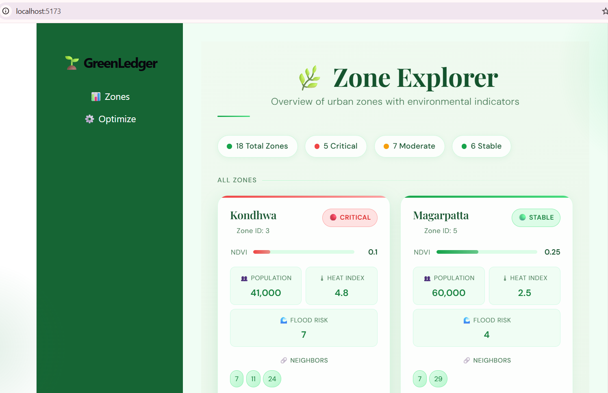
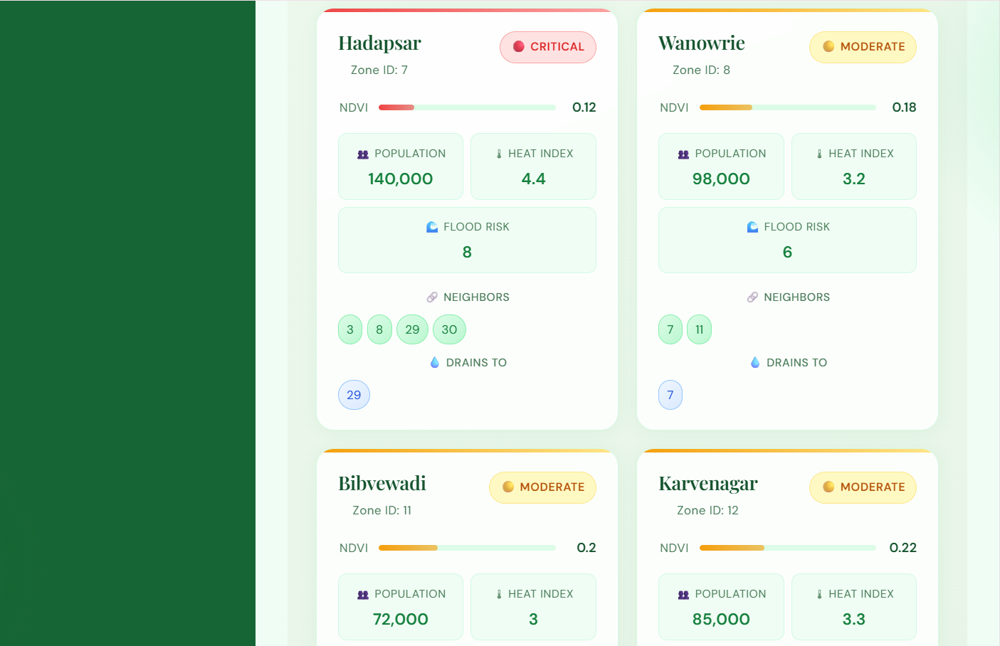
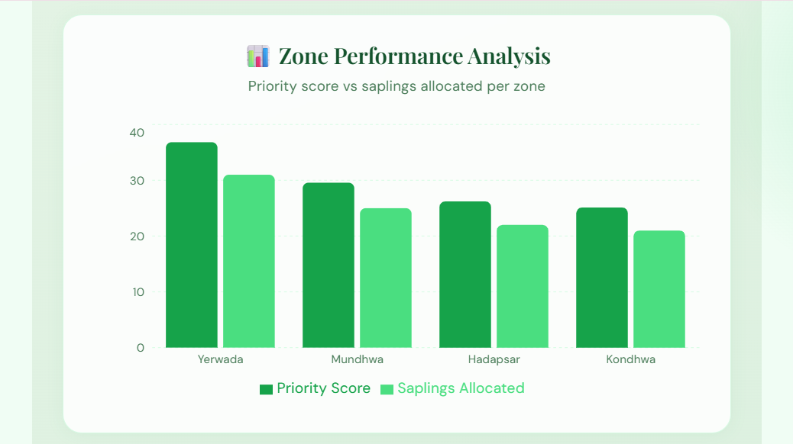
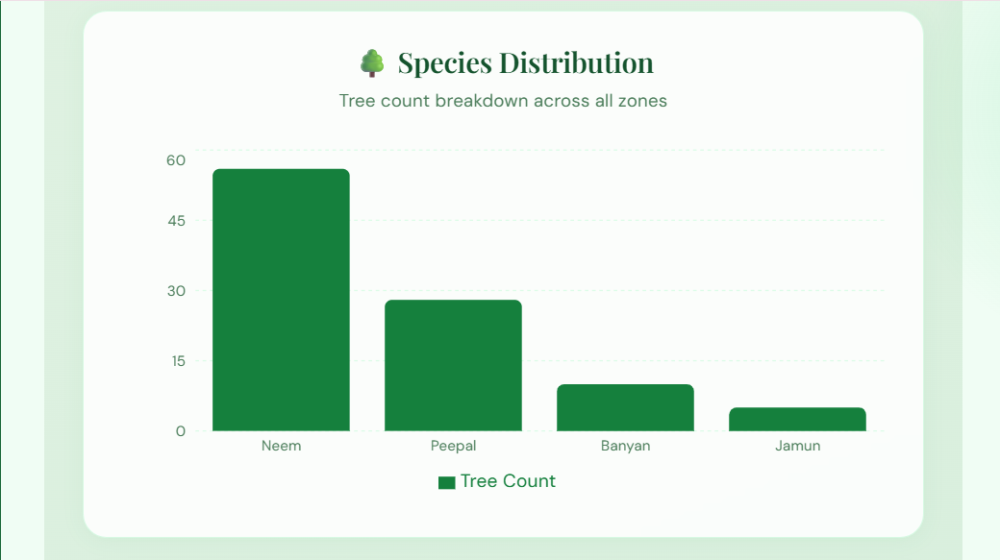
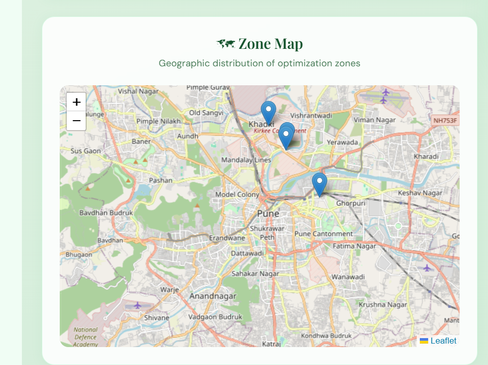
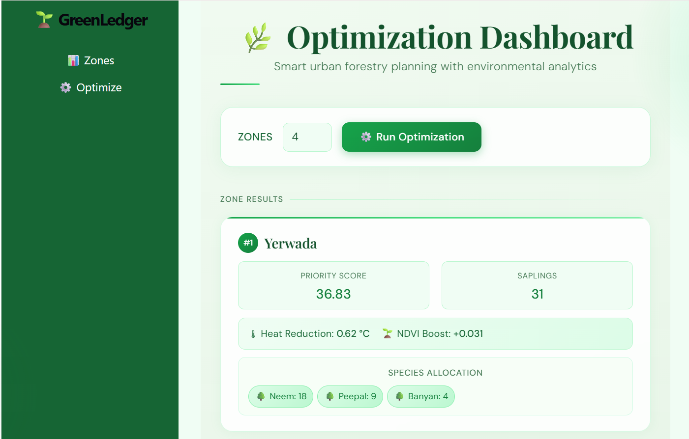
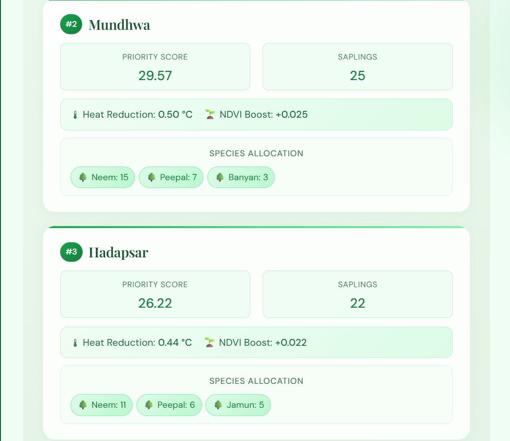
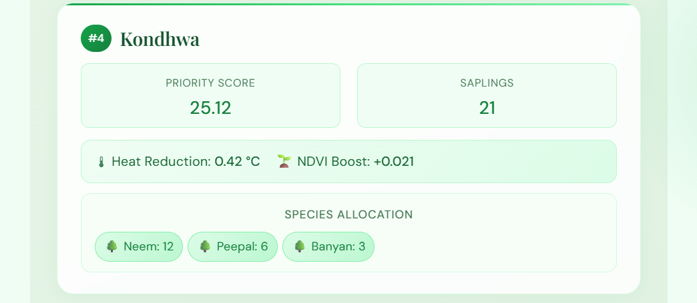

# 🌱 GreenLedger-System

> Intelligent Urban Plantation Optimization & Environmental Impact Simulation Platform

GreenLedger-System is a smart environmental optimization platform that identifies high-priority urban plantation zones and simulates the environmental impact of tree plantation using graph-based algorithms and optimization techniques.

---

# 🚀 Highlights

* 🌿 Environmental Zone Analysis
* 🌳 Smart Plantation Optimization
* 🔁 BFS-based Impact Propagation
* 📊 Before vs After Environmental Comparison
* 🌐 FastAPI + React Integration
* ⚡ Interactive Visualization Dashboard

---

# 🖼️ Project Preview

## Dashboard

<p align="center">
  
  
</p>

---

## Zone Analysis

<p align="center">
  
  
  
</p>

---

## Optimization Output

<p align="center">
  
  
    
</p>

# 🎥 Demo Video


```md
https://drive.google.com/file/d/1szD0G1-HC69FUWRgY-ykuyLorP3WSBZX/view?usp=sharing
```

---

# 💡 Problem Statement

Urban regions face increasing environmental challenges such as:

* Rising heat intensity
* Poor vegetation coverage
* Flood-prone zones
* High population density

GreenLedger-System helps identify the most environmentally critical zones where plantation can create maximum positive impact.

---

# ⚙️ How the System Works

```text
Environmental Data
        ↓
Zone Scoring Engine
        ↓
Priority Optimization
        ↓
Sapling Allocation
        ↓
BFS Impact Simulation
        ↓
Before vs After Analysis
```

---

# 🛠️ Tech Stack

## Backend

* Python
* FastAPI
* Pydantic
* BFS (Breadth First Search)
* Heap / Priority Queue

## Frontend

* React
* JavaScript
* Vite
* CSS

---

# ✨ Core Features

## 🌿 Environmental Scoring

Analyzes NDVI, heat index, flood risk, and population density.

## 🌳 Plantation Optimization

Selects top-priority zones using heap-based optimization.

## 🔁 Impact Simulation

Uses BFS traversal to simulate neighboring environmental improvements.

## 📊 Visualization Dashboard

Frontend interface for displaying analysis and simulation results.

---

# 🗂️ Project Structure

```bash
GreenLedger-System/
│
├── backend/
├── frontend/
└── README.md
```

---

# ⚡ Quick Setup

## Clone Repository

```bash
git clone https://github.com/mk26-coder-sudo/GreenLedger-System.git
cd GreenLedger-System
```

---

## Backend Setup

```bash
cd backend
pip install -r requirements.txt
uvicorn main:app --reload
```

Backend:

```bash
http://127.0.0.1:8000
```

API Docs:

```bash
http://127.0.0.1:8000/docs
```

---

## Frontend Setup

```bash
cd frontend
npm install
npm run dev
```

Frontend:

```bash
http://localhost:5173
```

---

# 👨‍💻 My Contributions

* Designed backend architecture using FastAPI
* Developed environmental scoring and optimization logic
* Implemented BFS-based impact propagation
* Built REST APIs for analysis and simulation
* Integrated frontend visualization with backend APIs
* Structured modular services for scalability

---

# 🤝 Team Collaboration

This project was developed collaboratively as part of a group project and later evolved with additional real-time data integration approaches.

---

# 🔮 Future Scope

* Real-time environmental dataset integration
* GIS and map visualization
* ML-based environmental prediction
* Cloud deployment
* Advanced analytics dashboard

---

# 📄 License

This project is intended for educational and research purposes.
